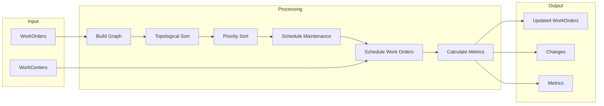
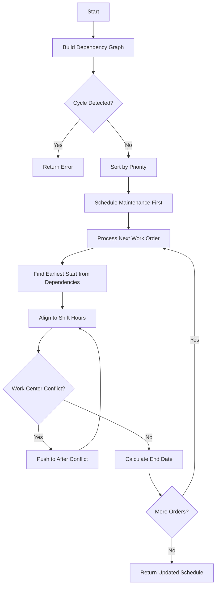
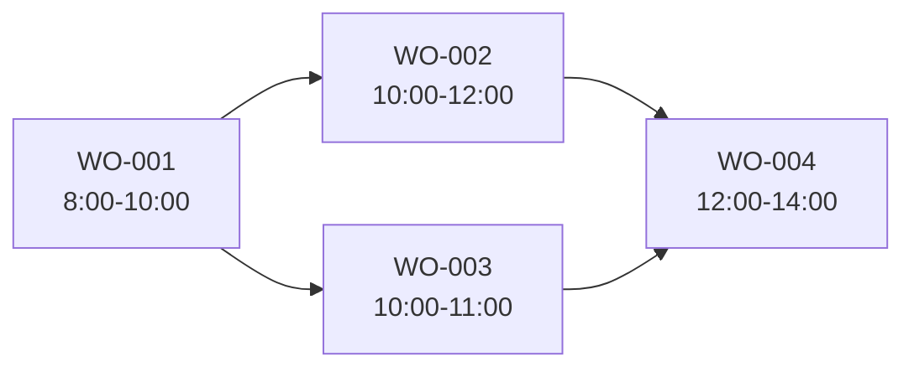

# Production Schedule Reflow System

A TypeScript-based production scheduling system that handles work order scheduling with constraint satisfaction.

## Features

- **Dependency Management**: Topological sorting with cycle detection
- **Work Center Conflicts**: Priority-based scheduling (1-5, lower = higher priority)
- **Shift Boundaries**: Respects work center operating hours
- **Maintenance Windows**: Avoids blocked time periods
- **Setup Time**: Accounts for pre-production setup time
- **Schedule Metrics**: Calculates delays, utilization, and rescheduling counts

## Installation

```bash
npm install
```

## Usage

### Run Demo

```bash
npm start
```

Runs 9 scenarios demonstrating different scheduling constraints.

### Run Tests

```bash
npm test
```

46 tests covering:
- Dependency graph operations
- Constraint validation
- Date utilities with shift handling
- Reflow service scenarios

## Architecture

### Project Structure

```
src/
  reflow/
    types.ts            # Core data structures (WorkOrder, WorkCenter, ReflowResult)
    reflow.service.ts   # Main scheduling algorithm
    dependency-graph.ts # DAG with topological sort
    constraint-checker.ts # Constraint validation
  utils/
    date-utils.ts       # Shift-aware date calculations
  data/
    scenario-*.ts       # Test scenarios
  index.ts              # Demo runner
```

### Data Flow

**Figure 1: Reflow Data Flow**



## Algorithm

**Figure 2: Scheduling Algorithm Flowchart**



**Steps:**
1. Build dependency graph and detect cycles (Kahn's algorithm)
2. Sort work orders by priority (1-5, lower = higher), then by start date
3. Schedule maintenance orders first (fixed, never move)
4. For each work order in priority order:
   - Find earliest start from dependencies
   - Align to next available shift time
   - Resolve work center conflicts (push forward until no overlap)
   - Calculate end date accounting for shifts and maintenance

## Constraints

| Constraint | Priority | Behavior |
|------------|----------|----------|
| Dependencies | 1 | Must wait for predecessors |
| Work Center | 2 | Lower priority number wins (1 beats 3) |
| Shifts | 3 | Work only during operating hours |
| Maintenance | 4 | Skip blocked time windows |

### Dependency Example

**Figure 3: Work Order Dependency Graph**



WO-004 cannot start until both WO-002 and WO-003 complete.

### Shift Spanning Example

**Figure 4: Work Spanning Overnight Shift Break**

```
Work Order: 120 min duration
Shift: Mon-Fri 8:00-17:00

Monday 16:00 ──────────────────────────────────────────► Tuesday 09:00
    │                                                        │
    ├── Work 60 min (16:00-17:00) ──┐                       │
    │                               │                       │
    │   ┌───────────────────────────┘                       │
    │   │ Pause overnight (shift ends)                      │
    │   └───────────────────────────┐                       │
    │                               │                       │
    │                               └── Resume 08:00 ───────┤
    │                                   Work 60 min         │
    └───────────────────────────────────────────────────────┘
```

### Maintenance Window Example

**Figure 5: Work Paused During Maintenance Window**

```
Work Order: 240 min (4 hours)
Maintenance: 10:00-14:00

08:00     10:00          14:00     16:00
  │         │              │         │
  ├─ Work ──┤              ├─ Work ──┤
  │ 120 min │  Maintenance │ 120 min │
  │         │   (blocked)  │         │
  ▼         ▼              ▼         ▼
┌───────────┬──────────────┬─────────┐
│  Working  │   Skipped    │ Working │
│  2 hours  │   4 hours    │ 2 hours │
└───────────┴──────────────┴─────────┘
```

## Test Scenarios

| Scenario | Description |
|----------|-------------|
| 0 | Baseline (no changes needed) |
| 1 | Delay cascade through dependencies |
| 2 | Shift spanning across days |
| 3 | Maintenance window avoidance |
| 4 | Multi-constraint (deps + maintenance + shifts) |
| 5 | Priority conflict (priority 1 beats priority 3) |
| 6 | Circular dependency (cycle detected) |
| 7 | Setup time handling |
| 8 | Large scale (2000 orders, 25 work centers) |

## Data Model

### WorkOrder
- `durationMinutes`: Working time required
- `setupTimeMinutes`: Setup time before production
- `priority`: 1-5, lower = higher priority (default 3)
- `dependsOnWorkOrderIds`: Predecessor work orders
- `isMaintenance`: Fixed time block flag

### WorkCenter
- `shifts`: Operating hours by day of week
- `maintenanceWindows`: Blocked time periods

### Metrics
- `totalDelayMinutes`: Sum of all delays
- `averageDelayMinutes`: Average delay per order
- `maxDelayMinutes`: Maximum single delay
- `utilizationByWorkCenter`: Working time / available time

## Trade-offs

### Greedy vs Optimization
- **Chosen:** Greedy algorithm (earliest available slot)
- **Trade-off:** May not minimize total delay, but predictable and fast
- **Rationale:** Simpler to understand, debug, and maintain; O(n²) worst case

### Push-forward vs Re-layout
- **Chosen:** Push-forward (move affected orders later)
- **Trade-off:** May leave gaps in schedule
- **Rationale:** Preserves user intent and schedule stability

### Priority Field (1-5)
- **Chosen:** Explicit priority field (lower number = higher priority)
- **Trade-off:** Requires priority assignment; ties broken by start date
- **Rationale:** Gives users explicit control over scheduling order

## Known Limitations

1. **No backfilling**: Gaps left by pushed orders are not filled by later orders
2. **Single work center per order**: Orders cannot span multiple work centers
3. **No partial shifts**: Cannot handle mid-day shift breaks (e.g., lunch)
4. **UTC only**: All dates assumed to be UTC, no timezone handling
5. **No optimization**: Does not minimize total delay or maximize utilization
6. **Memory**: Stores all slots in memory; may not scale to millions of orders

## AI Prompts

See `prompts/` directory for AI collaboration documentation:
- `algorithm-design.md` - Core algorithm decisions
- `shift-calculation.md` - Shift boundary handling
- `maintenance-windows.md` - Maintenance window logic
- `bonus-features.md` - Setup time, metrics, DAG
